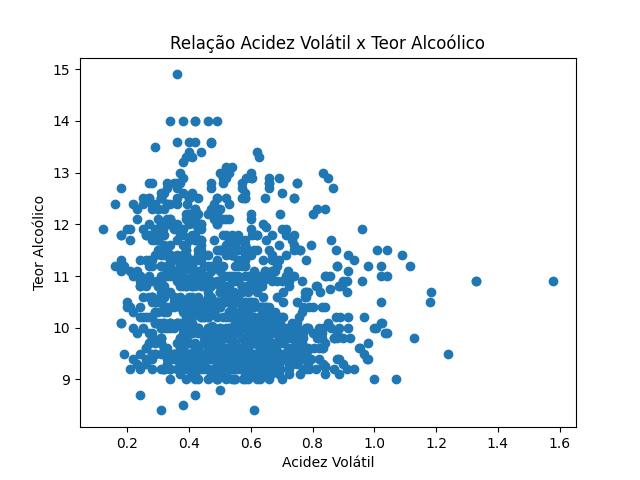
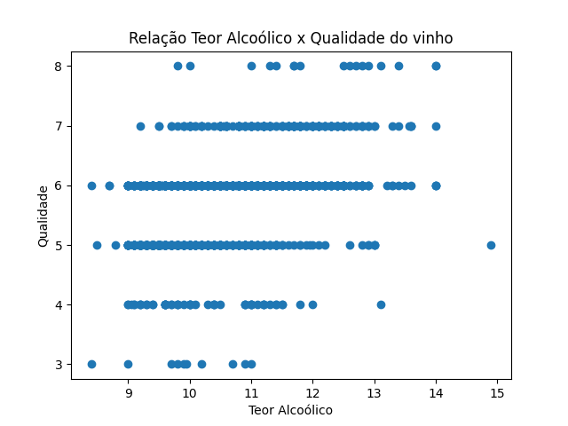
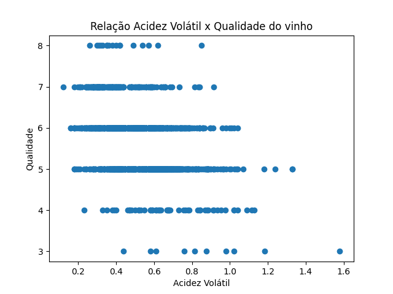

[🔃 (go-to 🇧🇷) Versão em Português](https://github.com/camimq/fiap_wine/blob/main/README_pt-BR.md)

# 👩‍💻 Exploratory Data Analysis Challenge 

> AIndividual activity of the Exploratory Data Analysis discipline of the postgraduate course in _Data Analytics_ at FIAP.

## 🎯 Proposal

Carry out analysis, according to the guidelines below:

> Aditional information: article from [Cortex et al.,2009](http://www3.dsi.uminho.pt/pcortez/wine5.pdf) about the analysis made on the dataset object of this project.

### 1. Import the `winequality-red.csv` dataset which can be downloaded from the following link: [here](https://archive.ics.uci.edu/ml/machine-learning-databases/wine-quality/winequality-red.csv).

```
# importing dataframe
wine_data = pd.read_csv('https://archive.ics.uci.edu/ml/machine-learning-databases/wine-quality/winequality-red.csv', sep=';')
```

### 2. Use Pandas to check the structure of the dataset (number of rows, columns, column data types, etc).

```
# checks the dataset structure
wine_data.dtypes

# checks data distribution in the dataset
wine_data.describe()

# checks dataset informationt
wine_data.info()
```

> - All columns are of type `float64`, except the `quality` column, which is of type `int64`.

### 3. Clean the dataset, removing duplicate rows and treating missing values.

```
# checks duplicate rows in the dataset
wine_data[wine_data.duplicated()]

# deletes duplicate lines, preserving dataframe with information without duplicates
wine_data.drop_duplicates(keep='first', inplace=True)
wine_data.info()

# checks missing data
wine_data.isnull().sum()
```
> No missing data was found in the dataset, after the first treatment carried out: deletion of duplicate lines.

### 4. Use Matplotlib to view the following information: </br>

#### a. Distribution of volatile acidity by wine quality.</br>


#### b. Distribution of alcohol content by wine quality.</br>


#### c. Relationship between volatile acidity and alcohol content.</br>


#### d. Relationship between alcohol content and wine quality.</br>


### 5. Analyze the results and answer the following questions:</br>
#### a. What is the average volatile acidity of high quality wines?</br>
  
In the article / source from which the _dataset_ is taken, I did not find any definition of the scoring range that determines that a high quality wine is ranked between 8 and 10, for example. Therefore, in order to create some sorte of reference on how this _ranking_ is done, I used the article on the [Famiglia Valduga](https://blog.famigliavalduga.com.br/o-que-e-e-como-funciona-o- wine-scoring-system/) blog, which says the following:

>_"To assign scores, tasters use a form with standardized criteria, which are evaluated separately to be as technical as possible. In terms of assigning points, it is common to give scores between 50 and 100, with the best wines being above 90._
>_In general, numerical classifications can be interpreted as follows:_</br>
>_- 100 to 90: these are excellent, rare or extraordinary wines;_</br>
>_- 89 to 80: these are wines with few defects and also considered well-made;_</br>
>_- 79 to 70: these are medium wines, which despite being pleasant are not very complex in flavors, aromas or body;_</br>
>_- 69 to 60: these are wines that are below average because they are considered unbalanced or flawed;_</br>
>_- 59 to 50: these are inferior, poor quality wines that are not acceptable for demanding palates."_
  
Considering the point of view of the article, it is viable to consider that high quality wines are those that have a score `>=` 8. So, answering the question, **the average volatile acidity of high quality wines, according to the data present in the dataset, it is 0.42764705882352944**.

```
wine_data[wine_data['quality'] >= 8]['volatile acidity'].mean()
```
#### **b.** What is the relationship between alcohol content and wine quality?</br>
  
Looking at the graph below, it is possible to notice the relationship between the alcohol content and the quality of the wine is strong, that is, the higher the alcohol content, the higher the quality of the wine. However, according to the article published by Cortex, the alcohol content is just one of the facts that influence the quality of the wine. For the answer to be complete, a broad analysis is necessary that includes all factors relevant to determining the quality of the product.


#### **c.** Is there any relationship between volatile acidity and alcohol content?</br>

The relationship between these two variables is weak. However, in the graph it is possible to observe that the higher the alcohol content, the lower the volatile acidity.


#### **d.** Is there any relationship between volatile acidity and wine quality?</br>

Yes. The graph below demonstrates that the relationship between acidity and quality is strong and that the higher the volatile acidity, the lower the quality of the wine.



##

FMade with ❤️ by Cami Queiroz 🎙 Let´s talk!

  