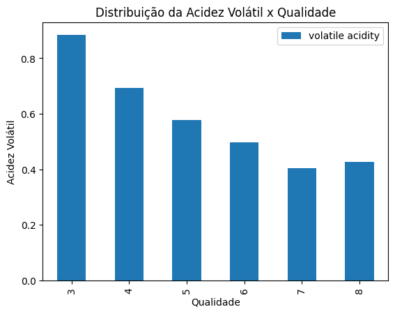
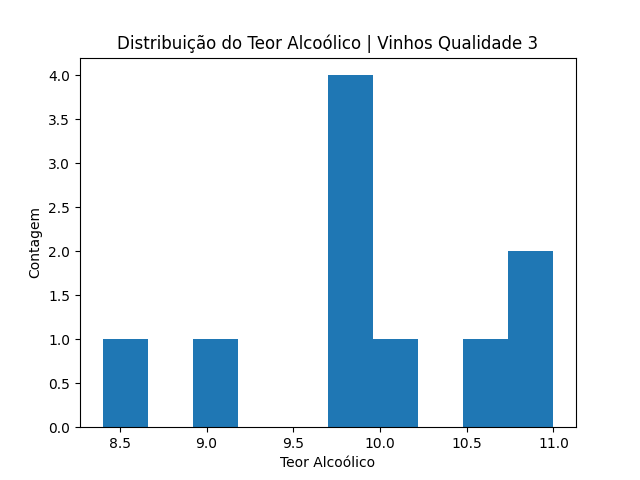
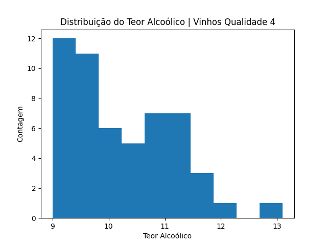
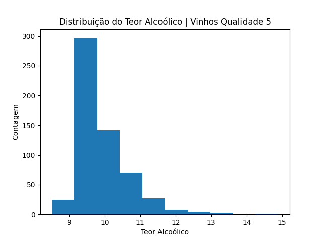
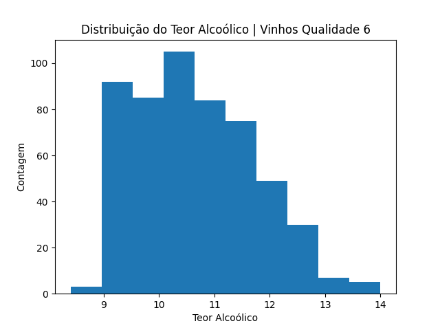
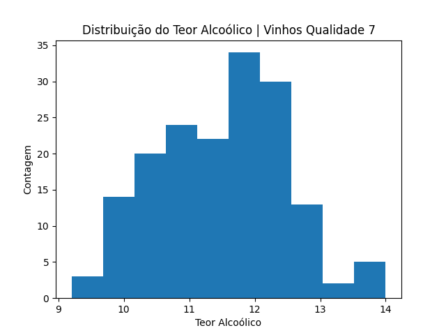
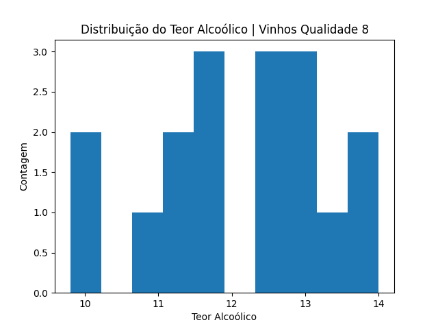

[🔃 (go-to 🇺🇸) English Version](https://github.com/camimq/fiap_wine/blob/main/README.md)

# 👩‍💻 Desafio Análise Exploratória de Dados 

> Atividade individual da disciplina de Análise Exploratória de dados do curso de pós-graduação em _Data Analytics_ da FIAP.

## 🎯 Proposta

Fazer análise, conforme orientações abaixo:

> Informações adicionais: artigo de [Cortex et al.,2009](http://www3.dsi.uminho.pt/pcortez/wine5.pdf) sobre a análise deste _dataset_.

### 1. Importe o dataset `winequality-red.csv` que pode ser baixado no seguinte link: [aqui](https://archive.ics.uci.edu/ml/machine-learning-databases/wine-quality/winequality-red.csv).

```
# importa dataframe
wine_data = pd.read_csv('https://archive.ics.uci.edu/ml/machine-learning-databases/wine-quality/winequality-red.csv', sep=';')
```

### 2. Utilize o Pandas para verificar a estrutura do dataset (número de linhas, colunas, tipos de dados das colunas, etc.).

```
# verifica estrutura do dataset
wine_data.dtypes

# verifica distribuição dos dados no dataset
wine_data.describe()

# verifica informações do dataset
wine_data.info()
```

> - Todas as colunas são do tipo `float64`, exceto a coluna `quality`, que é do tipo `int64`.

### 3. Limpe o _dataset_, removendo linhas duplicadas e tratando valores faltantes.

```
# verifica linhas duplicadas no dataset
wine_data[wine_data.duplicated()]

# deleta linhas duplicadas, preservando dataframe com a informação sem duplicatas
wine_data.drop_duplicates(keep='first', inplace=True)
wine_data.info()

# verifica dados faltantes
wine_data.isnull().sum()
```
> Não foram encontrados dados faltantes no dataset, após o primeiro tratamento feito: deleção de linhas duplicadas.

### 4. Utilize o Matplotlib para visualizar as seguintes informações: </br>

#### a. Distribuição da acidez volátil por qualidade do vinho.</br>


#### b. Distribuição do teor alcoólico por qualidade do vinho.</br>












#### c. Relação entre acidez volátil e teor alcoólico.</br>


#### d. Relação entre teor alcoólico e qualidade do vinho.</br>


### 5. Analise os resultados e responda às seguintes perguntas:</br>
#### a. Qual a acidez volátil média dos vinhos de qualidade elevada?</br>
  
No artigo ou na fonte de onde o _dataset_ é retirado, não encontrei nenhuma definição do range de pontuação que determine que um vinho de alta qualidade, está ranqueado entre 8 e 10, por exemplo. Por isso, para que tenhamos uma referência sobre como é feito este _ranking_, utilizei o artigo no blog do [Famiglia Valduga](https://blog.famigliavalduga.com.br/o-que-e-e-como-funciona-o-sistema-de-pontuacao-de-vinhos/), que diz o seguinte:

>_"Para atribuir notas, os degustadores usam uma ficha com critérios padronizados, os quais são avaliados separadamente para ser o mais técnico possível. Em termos de atribuição de pontos, é comum dar notas entre 50 e 100, sendo que os melhores vinhos, estão acima de 90 e poucos chegam a esse patamar._
>_De maneira geral, as classificações numéricas podem ser interpretadas assim:_</br>
>_- 100 a 90: são vinhos exelentes, raros ou extraordinários;_</br>
>_- 89 a 80: são vinhos com poucos defeitos e também considerados bem elaborados;_</br>
>_- 79 a 70: são os vinhos médios, que apesar de serem agradáveis não são muito complexos em sabores, aromas ou corpo;_</br>
>_- 69 a 60: são vinhos que estão abaixo da média por serem considerados como desequilibrados ou com falhas;_</br>
>_- 59 a 50: são vinhos inferiores, de má qualidade que não são aceitáveis para paladares exigentes."_
  
  Considerando o ponto de vista do artigo, podemos considerar que os vinhos de qualidade elevada são aqueles que possuem pontuação >= 8. Então, respondendo a pergunta, **a acidez volátil média dos vinhos de alta qualidade, de acordo com os dados presentes dentro do _dataset_, é de 0.42764705882352944**.

  ```
  wine_data[wine_data['quality'] >= 8]['volatile acidity'].mean()
  ```

#### b. Qual a relação entre teor alcoólico e qualidade do vinho?</br>
  
Olhando para o gráfico abaixo, é possível notar que a relação entre o teor alcoólico e a qualidade do vinho é forte, ou seja, quanto maior o teor alcoólico, maior a qualidade do vinho. Contudo, de acordo com o artigo publicado por Cortex, o teor alcoólico é apenas um dos fatos que influenciam na qualidade do vinho. Para que a resposta seja completa, é necessária uma análise ampla que contemple todos os fatores relevantes para a determinação da qualidade do produto.


#### c. Há alguma relação entre acidez volátil e teor alcoólico?</br>

A relação entre essas duas variáveis é fraca. Mas, no gráfico abaixo é possível observar que, quanto maior for o teor alcoólico, menor será a acidez volátil.


#### d. Há alguma relação entre acidez volátil e qualidade do vinho?</br>

Sim. O gráfico abaixo demonstra que a relação entre acidez e qualidade é forte e que, quanto maior a acidez volátil, menor é a qualidade do vinho.


##

Feito com ❤️ por Cami Queiroz 🎙 Vamos Falar!

  